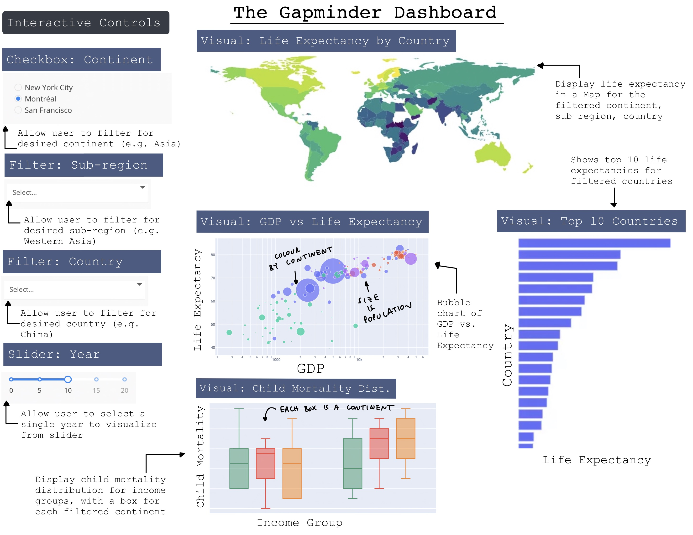

# mindthegap

An interactive dashboard for analyzing the Gapminder dataset

## Overview

### Proposed sketch

### App description

Our proposed dashboard is a landing page that displays key data contained in the [Gapminder dataset](https://raw.githubusercontent.com/UofTCoders/workshops-dc-py/master/data/processed/world-data-gapminder.csv).  Specifically, our dashboard is focused on displaying a visual analysis of the life expectancy variable that is contained within Gapminder.  The visualizations that we will include are:

1) A map that shows the life expectancy by country.  The countries will be coloured as a diverging colour palette to identify countries with low, medium, and high life expectancies.
2) A bubble chart that shows income versus life expectancy.  The bubbles will be sized by population and coloured by continent.
3) The distribution of child mortality for each income group, as visualized with boxplots for each continent.
4) A bar chart of the top 10 countries with the highest life expectancies.

Further, our dashboard will include several options that will allow the user to filter the data that is presented in the visualizations noted above.

Specifically the options that we will include are:

1) A checkbox for the user to select a continent to visualize (e.g. Asia).
2) A filter for the user to select a sub-region to visualize, if desired (e.g. Western Asia).
3) A filter for the user to select a country to visualize, if desired (e.g. China).
4) A slider that allows the user to select a single year to visualize (e.g. 2010).

With these options, the user will be able to observe trends over time in the desired filtered continent, sub-region, and/or countries that they so desire.  This will allow a user to grasp how life expectancy and the related visualizations have changed over time in different regions of the world.

## Support

If you run into troubles, please [check the issue list](https://github.com/UBC-MDS/mindthegap/issues) to see if your problem has already been reported or to open new issues.

## Contributions

|    Core contributor| Github.com username|
|-------------------  |-------------------|
|       Harry Chan    |  @harryyikhchan   |
|    Navya Dahiya     |  @nd265           |
|  Nico Van den Hooff |  @nicovandenhooff |
|      James Kim      |  @jamesktkim      |  

Feedback and suggestions are always welcome! Please read [the contributing guidelines](https://github.com/UBC-MDS/mindthegap/blob/main/CONTRIBUTING.md) to get started.

## Code of conduct

In the interest of fostering an open and welcoming environment, we as contributors and maintainers pledge to making participation in our project and our community a harassment-free experience for everyone, regardless of age, body size, disability, ethnicity, gender identity and expression, level of experience, nationality, personal appearance, race, religion, or sexual identity and orientation. Detailed descriptions
of these points can be found in [`CODE_OF_CONDUCT.md`](https://github.com/UBC-MDS/mindthegap/blob/main/CODE_OF_CONDUCT.md).

## License

`mindthegap` was created by Harry Chan, Navya Dahiya, Nico Van den Hooff and James Kim. It is licensed under the terms of the MIT license.
